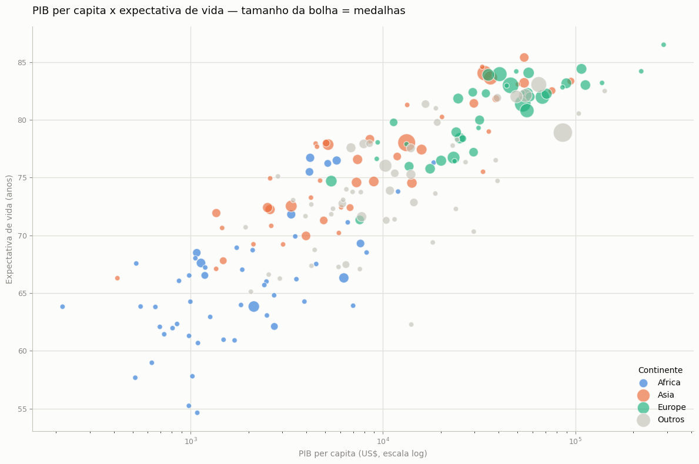
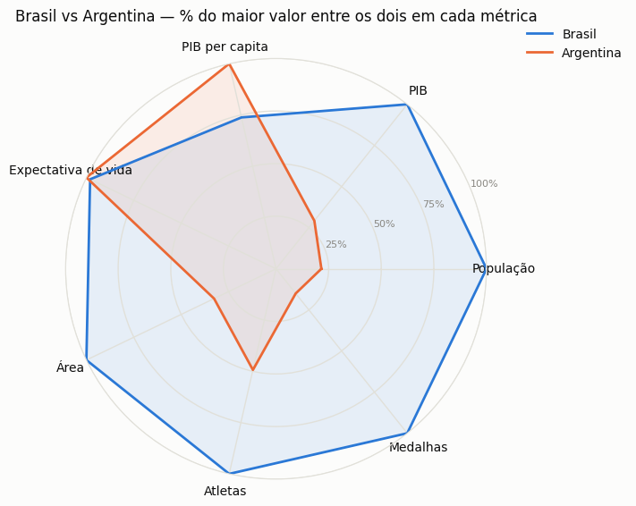
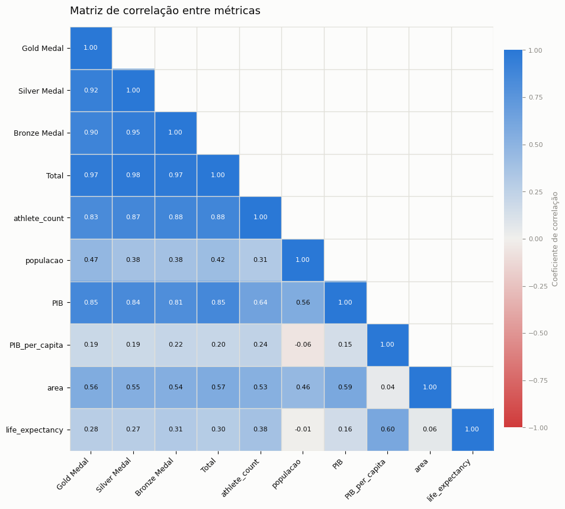
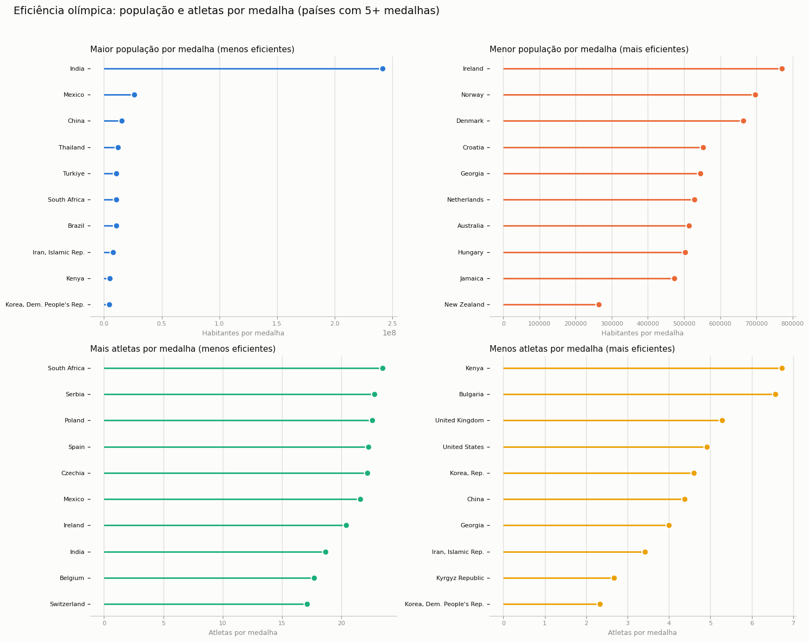
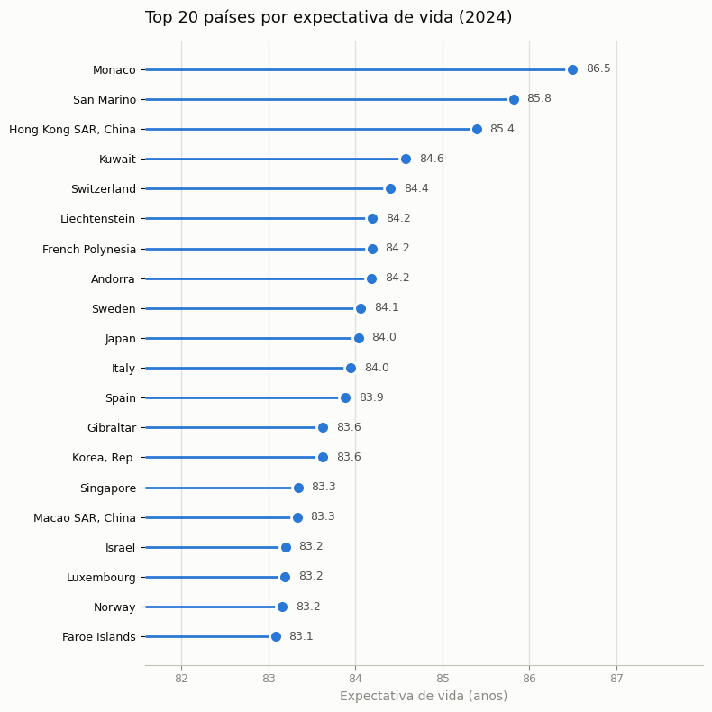
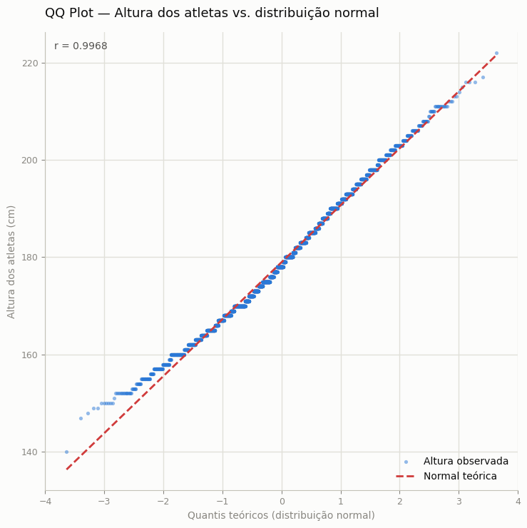
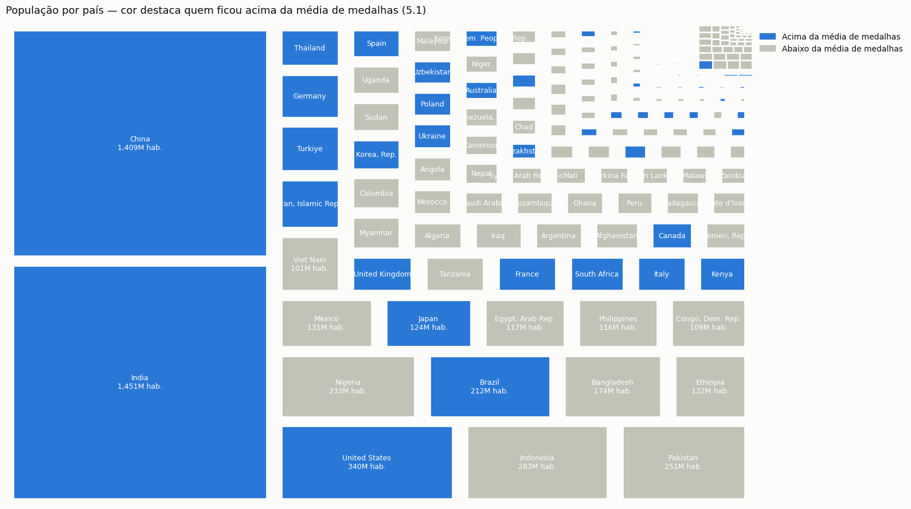

# 🏅 Análise Diagnóstica das Olimpíadas de Paris 2024

Cruzamento entre o desempenho dos países nas Olimpíadas de Paris 2024 e indicadores socioeconômicos do **World Bank** (PIB, PIB per capita, população, expectativa de vida e área territorial), para investigar o quanto riqueza e tamanho de um país se relacionam com seu sucesso olímpico.

[](https://www.python.org/)
[](https://pandas.pydata.org/)
[](https://scikit-learn.org/)
[](https://jupyter.org/)

📓 **[Ver o notebook completo](./analise_diagnostica_olimpiadas.ipynb)**

---

## Sobre o projeto

Este trabalho foi desenvolvido para a disciplina de Programação para Análise de Dados (IBMEC). Ele parte de duas fontes públicas — o [dataset das Olimpíadas de Paris 2024](https://www.kaggle.com/datasets/piterfm/paris-2024-olympic-summer-games) (Kaggle) e os [World Development Indicators](https://data.worldbank.org/) do World Bank — e as cruza numa única base por país para responder, com dados, uma pergunta simples: **será que os países mais ricos e mais populosos ganham mais medalhas?**

No caminho, o notebook também:
- Resolve um problema de qualidade de dados nada óbvio: o dataset olímpico identifica países pelo código do **COI**, que diverge do padrão **ISO-3166** usado pelo World Bank — e dois desses códigos colidem silenciosamente com os de *outros* países (Bahrein/Brunei, Chile/Channel Islands), o que exigiu correção manual verificada.
- Testa estatisticamente (QQ plot) se altura e peso dos atletas seguem distribuição normal, geral e por gênero.
- Treina e **valida com train/test split** um modelo de regressão linear que prevê medalhas a partir de indicadores de riqueza.

## Principais achados

- **O tamanho da economia (PIB) é o preditor mais forte entre os indicadores de riqueza** — mais do que PIB per capita ou população isoladamente. Um modelo de regressão linear com as três variáveis (padronizadas por z-score) atinge **R² = 0,74** nos dados de treino e **R² = 0,52** quando validado numa amostra de teste que nunca viu.
- **A correlação mais forte com o total de medalhas não é econômica — é o tamanho da delegação** (0,88 entre `athlete_count` e medalhas, contra 0,85 do PIB).
- **População sozinha não garante medalhas**: Índia, Nigéria, Indonésia e Paquistão, entre os países mais populosos do mundo, ficam abaixo da média de medalhas e no fundo do ranking de eficiência.
- Países como **Reino Unido, França, Austrália e Nova Zelândia** ganharam muito mais medalhas do que sua riqueza sozinha previa — sinal de que investimento esportivo dedicado pesa tanto quanto o tamanho da economia.
- **PIB per capita e expectativa de vida caminham juntos**, e os dois se relacionam com mais medalhas.
- **A altura dos atletas segue de perto uma distribuição normal** (r ≈ 0,997 combinada, ≈ 0,999 separada por gênero) — esperado pelo Teorema Central do Limite em populações grandes.

## Alguns dos gráficos

<table>
<tr>
<td width="50%">

**Riqueza, saúde e medalhas por continente**


</td>
<td width="50%">

**Brasil vs. Argentina**


</td>
</tr>
<tr>
<td width="50%">

**Correlação entre métricas**


</td>
<td width="50%">

**Eficiência olímpica**


</td>
</tr>
<tr>
<td width="50%">

**Expectativa de vida — top 20 países**


</td>
<td width="50%">

**Normalidade da altura dos atletas**


</td>
</tr>
</table>

**População x desempenho (treemap)**


## Estrutura da análise

1. **Coleta** — dados olímpicos via `kagglehub`; indicadores do World Bank via CSV
2. **Limpeza** — anos sem dado, metadados extras nos CSVs, tradução de códigos de país (COI → ISO-3166)
3. **Cruzamento** — `left join` de 7 tabelas numa base única por país (265 países/territórios)
4. **Exploração** — ranking, radar comparativo, correlação, treemap, eficiência olímpica, bubble chart por continente
5. **Inferência estatística** — QQ plots de altura e peso (geral e por gênero)
6. **Modelagem preditiva** — regressão linear com padronização z-score, validada com train/test split

## Estrutura do repositório

```
.
├── README.md
├── analise_diagnostica_olimpiadas.ipynb   # notebook principal
├── data/                                  # indicadores do World Bank (CSV)
│   ├── API_AG.SRF.TOTL.K2_DS2_en_csv_v2_34852.csv   # área territorial
│   ├── API_NY.GDP.MKTP.CD_DS2_en_csv_v2_234.csv     # PIB
│   ├── API_NY.GDP.PCAP.CD_DS2_en_csv_v2_33610.csv   # PIB per capita
│   ├── API_SP.DYN.LE00.IN_DS2_en_csv_v2_408.csv     # expectativa de vida
│   └── API_SP.POP.TOTL_DS2_en_csv_v2_33112.csv      # população
└── images/                                # gráficos exportados para este README
```

## Como rodar

```bash
pip install pandas numpy matplotlib scipy scikit-learn kagglehub squarify pycountry_convert
jupyter notebook analise_diagnostica_olimpiadas.ipynb
```

O notebook baixa automaticamente o dataset das Olimpíadas via `kagglehub` na primeira execução. Os 5 arquivos de indicadores do World Bank já estão incluídos neste repositório, em `data/`.

## Fontes de dados

- [Paris 2024 Olympic Summer Games](https://www.kaggle.com/datasets/piterfm/paris-2024-olympic-summer-games) — Kaggle
- [World Development Indicators](https://data.worldbank.org/) — World Bank (PIB, PIB per capita, população, expectativa de vida, área)

## Autor

João Pedro Dantas — IBMEC, 5º período, Programação para Análise de Dados
